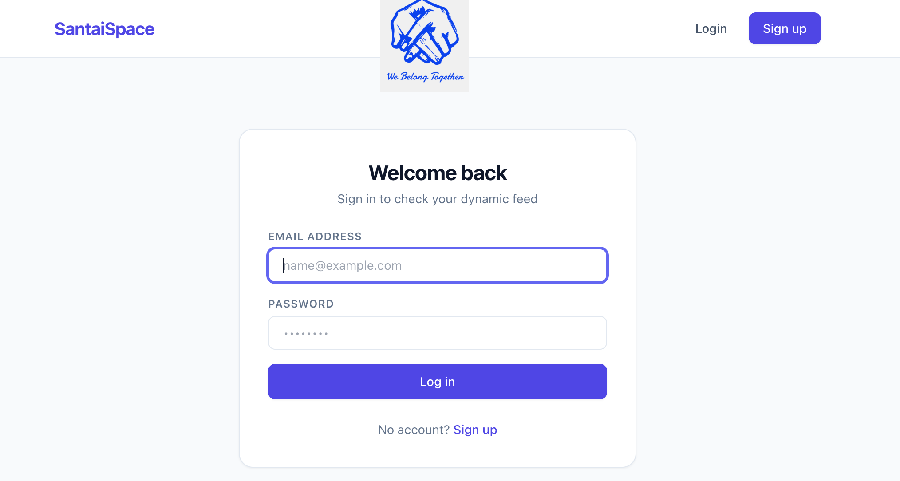
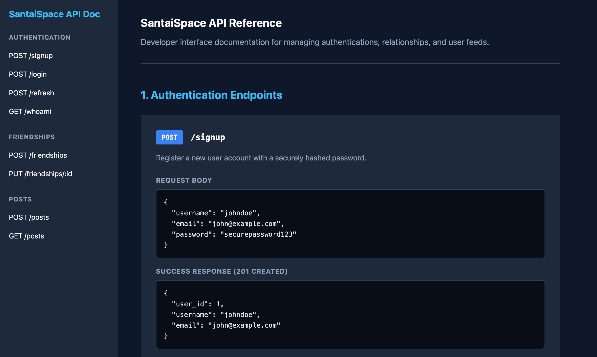

# <p align="center">🌌 SantaiSpace Frontend</p>

<p align="center">
  
  
  
  
</p>

<p align="center">
  <strong>The official frontend client application for SantaiSpace.</strong><br />
  A elegant, high-performance social media workspace interface designed to manage secure session states, real-time post timelines, and user friendship graphs via a remote production backend layer.
</p>

---

## 🚀 Key Features

- **🛡️ Authentication Guarding**  
  Implements specialized, higher-order route wrappers (`RequireAuth` and `GuestOnly`) to strictly isolate public landing templates from authenticated workspace streams.
- **🔑 Persistent Context Engine**  
  Powered by a reactive, global `AuthProvider` state configuration that watches, validates, and manages active user tokens securely across updates.
- **🧭 Dynamic Context Navigation**  
  Features an adaptive, sticky navigation header that morphs available action sets dynamically between guest modes (Login/Signup) and authed operations (Feed/Friends/Logout).
- **📱 Ultra-Responsive Fluid Layout**  
  Engineered around a modern slate typography theme using structural Tailwind grid primitives mapped smoothly inside an anti-aliased view container.

---

## 🛠️ Tech Stack

- **Core Runtime Framework:** React Engine
- **Application Routing Core:** React Router DOM (v6)
- **Styling & Layout Utility:** Tailwind CSS Engine
- **Cloud Architecture Provider:** Railway App Engine

---

## 🗂️ Project Architecture & Routing

The routing core runs explicit check evaluations before granting client entry to layout nodes. Protected resource tracks automatically eject invalid sessions:

| Target Endpoint Path | Component Interface | Runtime Route Guard | Operational Context Purpose             |
| :------------------- | :------------------ | :------------------ | :-------------------------------------- |
| `/signup`            | `<Signup />`        | `GuestOnly`         | Register new user profile               |
| `/login`             | `<Login />`         | `GuestOnly`         | Exchange credentials for session tokens |
| `/feed`              | `<Feed />`          | `RequireAuth`       | Chronological social feed timeline      |
| `/friends`           | `<Friends />`       | `RequireAuth`       | Relationship and connection dashboard   |
| `*`                  | _Wildcard Fallback_ | _None_              | Redirects automatically to `/feed`      |

---

## 🌐 API Reference Configurations

The web client decouples endpoint pathways from application logic using a global endpoint constant registry targeted at the remote production gateway.

```yaml
Base Live Server URL: "https://social-backend-production-019c.up.railway.app"
```

- **Session Handlers**
  - `signup` ➡️ `${BASE_URL}/signup` — Create user account profiles
  - `login` ➡️ `${BASE_URL}/login` — Authenticate and provision temporary access tokens
- **Feed Timelines**
  - `posts` & `createPost` ➡️ `${BASE_URL}/posts` — Fetch active timeline streams & publish structural entries
- **Social Connections**
  - `friends` ➡️ `${BASE_URL}/friendships` — Direct social connection link requests & status state transitions
  - `users` ➡️ `${BASE_URL}/users` — Global system community listings search directory

---

## ⚙️ Installation & Local Setup

Get your local staging environment operational within minutes by following these simple command operations:

### 1. Clone the Directory

Replicate the core repository files down to your local workspace destination:

```bash
git clone <repository-url>
cd santaispace-frontend
```

### 2. Install Project Dependencies

Verify that you have [Node.js](https://nodejs.org) present on your device system environment, then resolve package maps:

```bash
npm install
```

### 3. Launch Development Server

Boot the engine up inside a local hot-reloading development pipeline:

```bash
npm run dev
```

> 💡 _Note: The local browser application typically mounts and listens at `http://localhost:5173`_

### 4. Build Production Targets

Compile, compress, and bundle optimized client builds ready for structural hosting deployment:

```bash
npm run build
```

## ⚙️ Screenshots

### Frontend



### Backend


